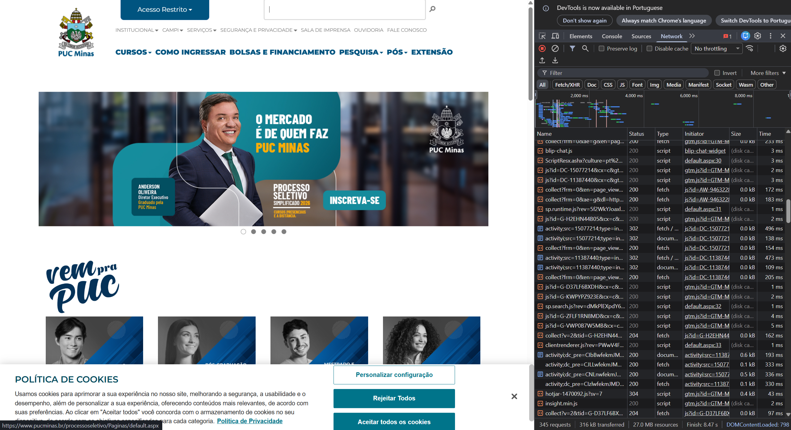

# Trabalho Prático - Semanas 1 e 2

## Informações Gerais

Nome: Raphael Ruan Victor Leite de Lima
Matricula: 917322

## Tela de inspeção com navegador

Print da tela com os testes de inspeção de conexão feitos com o navegador.

Print do resultado apresentado no navegador para o arquivo index.html.

## Orientações sobre Linguagem MarkDown

Acesse e leia o [tutorial do GitHub com a sintaxe básica para escrita de texto em Markdown](https://docs.github.com/pt/get-started/writing-on-github/getting-started-with-writing-and-formatting-on-github/basic-writing-and-formatting-syntax).

Veja aqui o exemplo de como colocar uma imagem nos locais acima. 

